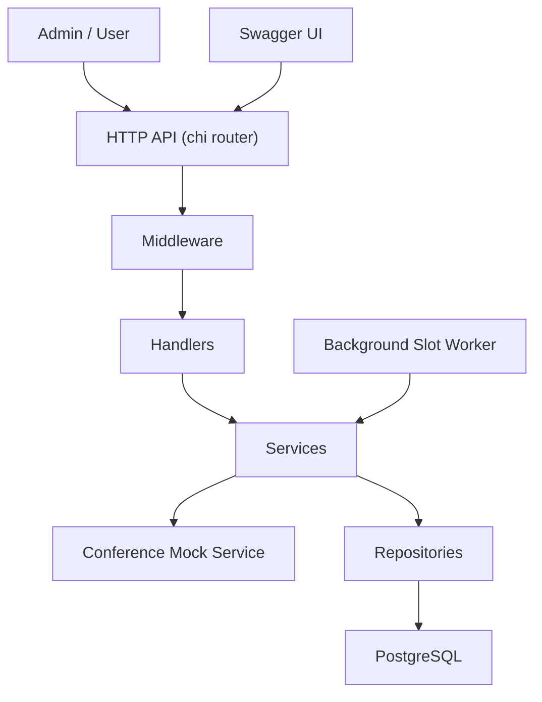
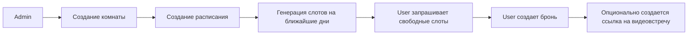

# Room Booking Service

Backend-сервис для бронирования переговорных комнат.

## Что умеет сервис

- регистрация и логин по email/password
- выдача JWT-токена и разделение ролей `admin` / `user`
- создание и просмотр переговорных комнат
- настройка расписания комнаты
- автоматическая генерация слотов на несколько дней вперед
- просмотр доступных слотов по комнате и дате
- создание бронирования пользователем
- отмена бронирования как idempotent-операция
- опциональное создание ссылки на видеовстречу через mock-интеграцию
- Swagger UI для просмотра и тестирования API

## Стек

- Go 1.26
- Chi
- PostgreSQL
- pgx
- JWT
- Docker Compose
- Swagger
- k6
- GitHub Actions

## Технические особенности

В проекте реализованы типичные для backend-сервисов решения:

- Производительность: слоты заранее генерируются и сохраняются в БД, что позволяет читать данные по индексам без сложных вычислений в runtime
- Работа с внешними эффектами: создание бронирования может включать внешний вызов (conference link)
- Обработка partial failure: при сбое после внешнего вызова выполняется best-effort cleanup
- Идемпотентность: повторные запросы на отмену бронирования безопасны и не приводят к дублированию операций

## Архитектура

Проект разбит на понятные слои:

- `cmd/app` — точка входа, HTTP-сервер, wiring зависимостей
- `internal/*` — инкапсулированная бизнес-логика сервиса, организованная по слоям: transport -> service -> repository.
- `migrations` — схема базы данных
- `docs` — сгенерированная Swagger-документация
- `loadtest` — k6-сценарий и пример результатов
- `cmd/seed` — заполнение демо-данными

### Схема компонентов



### Бизнес-флоу бронирования



Основной поток работы такой:

1. `admin` создает комнату.
2. `admin` задает для комнаты расписание.
3. Сервис сразу генерирует слоты на ближайшие дни.
4. Фоновый воркер периодически догенерирует новые слоты вперед.
5. `user` получает список свободных слотов и создает бронирование.

## Модель данных

В PostgreSQL используются основные сущности:

- `users`
- `rooms`
- `schedules`
- `slots`
- `bookings`

Что важно в схеме:

- у комнаты может быть только одно расписание
- слоты уникальны по `(room_id, start_at)`
- активное бронирование на слот может быть только одно
- для быстрых чтений добавлены индексы на слоты и бронирования

## Быстрый старт

### 1. Запуск проекта

Самый простой способ поднять проект локально:

```bash
make up
```

или:

```bash
docker compose up --build
```

После старта API будет доступен по адресу:

```text
http://localhost:8080
```

Healthcheck:

```bash
curl -i http://localhost:8080/_info
```

Swagger UI:

```text
http://localhost:8080/swagger/index.html
```

### 2. Заполнение демо-данными

```bash
make seed
```

После этого будут доступны тестовые пользователи:

- `admin@example.com` / `Admin123!`
- `user@example.com` / `User123!`

### 3. Переменные окружения

Для локального запуска можно использовать [`.env.example`](./.env.example).

Основные переменные:

- `DB_HOST`, `DB_PORT`, `DB_USER`, `DB_PASSWORD`, `DB_NAME`
- `JWT_SECRET`, `JWT_ACCESS_TOKEN_TTL`
- `WORKER_SLOT_GENERATION_DAYS`, `WORKER_INTERVAL`
- `CONFERENCE_MOCK_FAIL_CREATE`, `CONFERENCE_MOCK_FAIL_DELETE`

Если запускать через `docker compose`, значения по умолчанию уже подходят для локальной разработки.

## Быстрая проверка API

Если хочется быстро пройти сценарий руками, можно:

1. Открыть Swagger UI и вызвать `POST /dummyLogin` с ролью `admin` или `user`.
2. Подставить полученный Bearer token в авторизацию Swagger.
3. Под `admin` создать комнату и расписание.
4. Под `user` посмотреть доступные слоты и создать бронирование.

Это удобно для демонстрации проекта без предварительной ручной регистрации пользователей.

## Основные endpoint'ы

### Публичные

- `POST /register` — регистрация пользователя
- `POST /login` — логин по email/password
- `POST /dummyLogin` — получение тестового JWT для роли `admin` или `user`
- `GET /_info` — healthcheck

### Под авторизацией

- `GET /rooms/list` — список комнат
- `POST /rooms/create` — создание комнаты (`admin`)
- `POST /rooms/{roomID}/schedule/create` — создание расписания (`admin`)
- `GET /rooms/{roomID}/slots/list?date=YYYY-MM-DD` — доступные слоты комнаты на дату
- `POST /bookings/create` — создать бронирование (`user`)
- `GET /bookings/my` — мои будущие бронирования (`user`)
- `POST /bookings/{bookingID}/cancel` — отменить бронирование (`user`)
- `GET /bookings/list?page=1&pageSize=20` — список всех бронирований (`admin`)

## Работа с conference link

При создании бронирования можно попросить сервис дополнительно создать ссылку на видеовстречу:

```json
{
  "slotId": "uuid",
  "createConferenceLink": true
}
```

Сейчас это mock-интеграция, но она моделирует важную backend-ситуацию: локальное создание записи связано с внешним вызовом.

Поддерживаются сценарии отказа:

- если внешний сервис недоступен, создание бронирования завершается ошибкой `503`
- если внешняя ссылка создалась, но запись в БД сохранить не удалось, сервис пытается удалить внешнюю ссылку
- если `createConferenceLink=false`, внешние вызовы не делаются

Для симуляции ошибок есть флаги:

- `CONFERENCE_MOCK_FAIL_CREATE=true`
- `CONFERENCE_MOCK_FAIL_DELETE=true`

## Тесты и качество

Запуск тестов:

```bash
make test
```

Команда запускает:

- `go test ./...`
- подсчет покрытия в `coverage.out`
- сводку coverage через `go tool cover`

Дополнительно в проекте есть:

- unit- и HTTP-тесты по основным модулям
- CI в GitHub Actions с шагами `test` и `build`
- генерация Swagger из аннотаций в handler'ах

Пересобрать Swagger:

```bash
make swagger
```

## Нагрузочное тестирование

Для самого горячего endpoint'а `GET /rooms/{roomId}/slots/list?date=YYYY-MM-DD` есть k6-сценарий:

```bash
make loadtest
```

В репозитории сохранен пример результата в [loadtest/results.md](./loadtest/results.md).

На одном из прогонов сервис показал:

- `100 RPS`
- `3000/3000` успешных запросов
- `p99 = 1.62 ms`

Это не microbenchmark, а black-box тест по реальному HTTP-маршруту с middleware, сервисным слоем, PostgreSQL и сериализацией ответа.

## Команды

```bash
make up
make seed
make test
make swagger
make loadtest
```

## Структура репозитория

- [`cmd/app`](./cmd/app) — основной HTTP-сервис
- [`cmd/seed`](./cmd/seed) — сидирование демо-данных
- [`internal/auth`](./internal/auth) — регистрация, логин, JWT
- [`internal/room`](./internal/room) — комнаты
- [`internal/schedule`](./internal/schedule) — расписания
- [`internal/slot`](./internal/slot) — генерация и выдача слотов
- [`internal/booking`](./internal/booking) — бронирования
- [`internal/worker`](./internal/worker) — фоновая генерация слотов
- [`migrations`](./migrations) — SQL-миграции
- [`docs`](./docs) — Swagger-артефакты
- [`loadtest`](./loadtest) — нагрузочное тестирование
